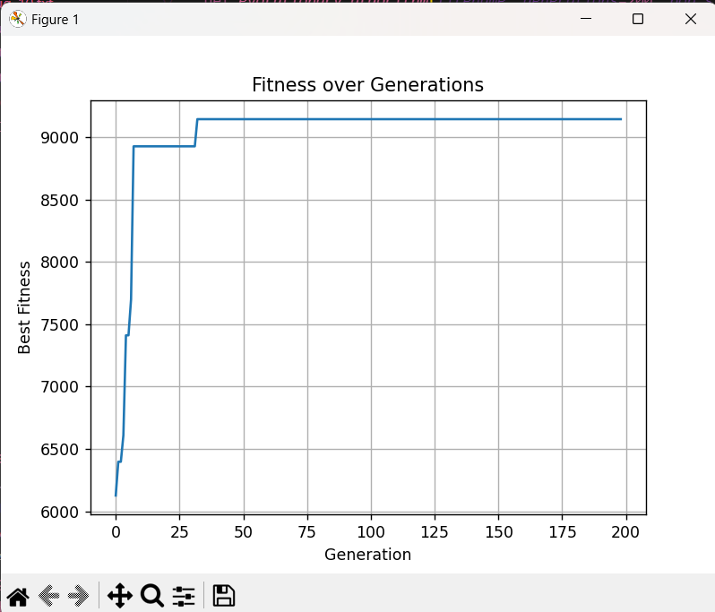
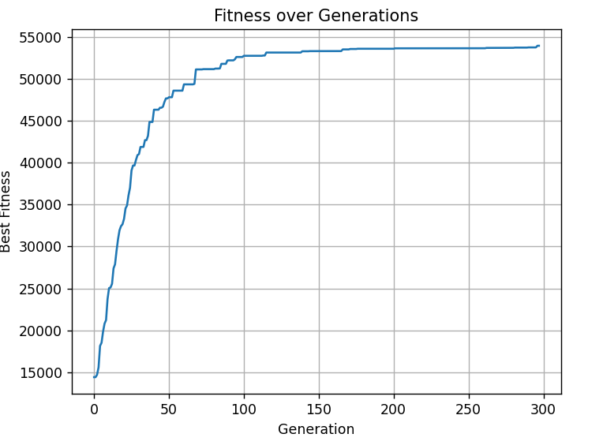

# Evolutionary Algorithm for the Knapsack Problem

## Problem Statement

Given a set of n items with weights wᵢ and values cᵢ, find a subset of items whose **total weight** does not exceed the knapsack capacity W, and whose **total cost** is maximized.


### Encoding of Individuals

Each individual is represented as a binary list of length n:
- 1 means the item is included in the knapsack.
- 0 means the item is excluded.

### Fitness Function

The fitness is the total value of the selected items if the total weight does not exceed W; otherwise, fitness is 0. I tried some other strategies, as for making some soft penalization instead of putting 0 but it did not lead to better results.

### Initialization

Each individual is initialized randomly but constrained to stay within the weight limit by adding items one by one in random order.

### Selection Method

Tournament selection is used:
- 3 individuals are selected at random.
- The one with the highest fitness is chosen as a parent.

Then after I increased the nubmer to 4 the performace actulally improved quite significantly.

### Crossover 

Two methods were tested:

- **One-point crossover (initial version):**
  A random cut point is selected; the first part comes from one parent, the second from the other.

  The result were:
```
Generation 0: Best Fitness = 11865
Generation 10: Best Fitness = 18870
.
.
.
Generation 210: Best Fitness = 49329
Generation 220: Best Fitness = 49329
Generation 230: Best Fitness = 49400
Generation 240: Best Fitness = 49857
Generation 248: Best Fitness = 49857

Best solution found:
Total value: 49857
Total weight: 4992
```

```
Generation 0: Best Fitness = 12380
Generation 10: Best Fitness = 19647
.
.
.
Generation 180: Best Fitness = 51556
Generation 190: Best Fitness = 51746
Generation 199: Best Fitness = 51933

Best solution found:
Total value: 51933
Total weight: 4946
```
- **Uniform crossover:**
  Each gene is taken randomly from one of the two parents with equal probability.

Uniform crossover significantly improved performance and was used in the final implementation.
```
Generation 0: Best Fitness = 11862
Generation 10: Best Fitness = 20985
Generation 20: Best Fitness = 28355
.
.
.
Generation 240: Best Fitness = 52653
Generation 248: Best Fitness = 52703

Best solution found:
Total value: 52703
Total weight: 4953
```

### Mutation

Each bit has a probability `1/n` to flip.

### Elitism

The individual with the best fitness from each generation is always preserved in the next generation.

### Generation Count

The number of generations is calculated logarithmically based on the number of items for better perfirmance:
```python
generations = int(30 * math.log2(n))  
```
## How to run
```
python knapsack.py
```

## The Best solutions
for input_100
```
Generation 0: Best Fitness = 5991
Generation 10: Best Fitness = 8187
Generation 20: Best Fitness = 9147
Generation 30: Best Fitness = 9147
Generation 40: Best Fitness = 9147
Generation 50: Best Fitness = 9147
Generation 60: Best Fitness = 9147
Generation 70: Best Fitness = 9147
Generation 80: Best Fitness = 9147
Generation 90: Best Fitness = 9147
Generation 100: Best Fitness = 9147
Generation 110: Best Fitness = 9147
Generation 120: Best Fitness = 9147
Generation 130: Best Fitness = 9147
Generation 140: Best Fitness = 9147
Generation 150: Best Fitness = 9147
Generation 160: Best Fitness = 9147
Generation 170: Best Fitness = 9147
Generation 180: Best Fitness = 9147
Generation 190: Best Fitness = 9147
Generation 198: Best Fitness = 9147

Best solution found:
Total value: 9147
Total weight: 985
```
for input_1000
```
Generation 0: Best Fitness = 12573
Generation 10: Best Fitness = 23744
Generation 20: Best Fitness = 33906
Generation 30: Best Fitness = 39852
Generation 40: Best Fitness = 42780
Generation 50: Best Fitness = 46216
Generation 60: Best Fitness = 48339
Generation 70: Best Fitness = 49678
Generation 80: Best Fitness = 50591
Generation 90: Best Fitness = 51354
Generation 100: Best Fitness = 51574
Generation 110: Best Fitness = 52105
Generation 120: Best Fitness = 52602
Generation 130: Best Fitness = 52816
Generation 140: Best Fitness = 52969
Generation 150: Best Fitness = 53206
Generation 160: Best Fitness = 53304
Generation 170: Best Fitness = 53532
Generation 180: Best Fitness = 53647
Generation 190: Best Fitness = 53647
Generation 200: Best Fitness = 53647
Generation 210: Best Fitness = 53647
Generation 220: Best Fitness = 53647
Generation 230: Best Fitness = 53746
Generation 240: Best Fitness = 53865
Generation 250: Best Fitness = 53933
Generation 260: Best Fitness = 54044
Generation 270: Best Fitness = 54044
Generation 280: Best Fitness = 54064
Generation 290: Best Fitness = 54064
Generation 297: Best Fitness = 54064

Best solution found:
Total value: 54064
Total weight: 5001
```
## Graphs
for input_100


for input_1000


